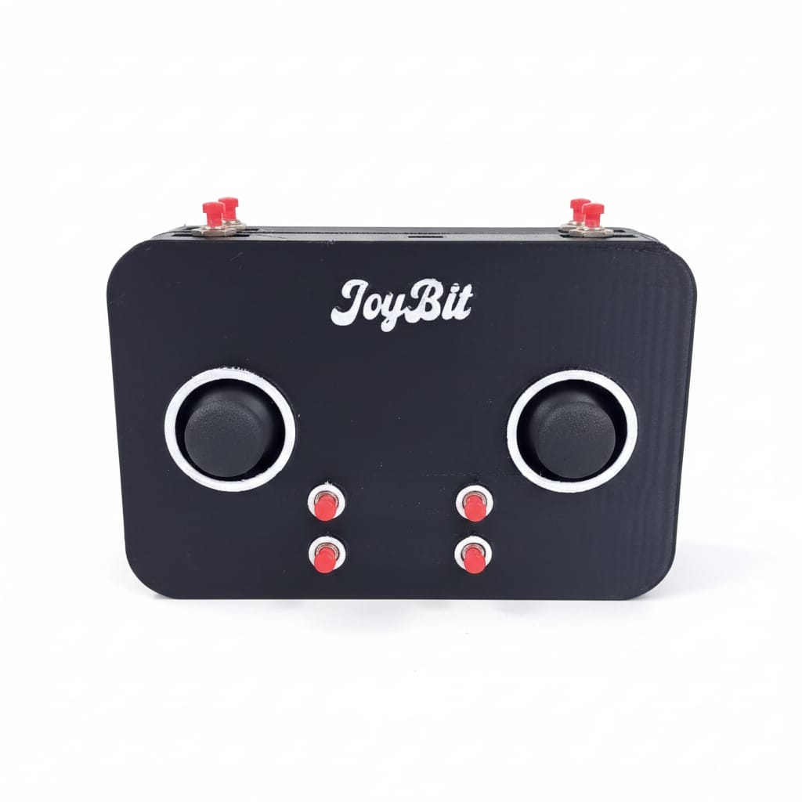

# JoyBit — Hardware Integration Portal

<h1 align="center">
  <br>
  JoyBit Platform
  <br>
</h1>

<p align="center">
  A dedicated web interface engineered for hardware-software synchronization, monitoring, and interaction with physical controller inputs.
</p>

<p align="center">
  
  
  
</p>

<p align="center">
  
</p>

---

## Project Overview

JoyBit is an interactive web-based environment designed to interface directly with physical controller hardware architectures. The platform serves as a visualization and processing hub, allowing real-time mapping, input validation, and signal telemetry from peripheral devices to the application layers.

## Hardware Configuration & Peripherals

To successfully assemble and initialize the physical control interface compatible with JoyBit, ensure the following core schemas, microcontrollers, and documentation guides are met:

1. **Microcontroller Firmware:** Implementation utilizes the specialized ESP32 and Arduino embedded codebase designed by KARTIS.  
   * Source Repository: [LegendofKARTIS/diy-joystick](https://github.com/LegendofKARTIS/diy-joystick)
2. **Schematic Implementation Guide:** Step-by-step physical pinout wiring, serial bridge communication setups, and component assembly instructions.  
   * Technical Reference Tutorial: [Video Assembly Demonstration](https://www.youtube.com/watch?v=Fp8zheckTXw)

### Case

For this one I made the case with Fusion360, it has a few issues with the design, but you can totally use and modify it! (the files are the ones with .stl termination at the repo)

<p align="center">
   
</p>

## Local Development & Execution

### Prerequisites
Prior to deploying the local development runtime environment, ensure your workstation satisfies the following dependency:
* **Node.js** (LTS version recommended for core runtime stability).

### Installation Steps

1. Clone or download the source code structure into your local development space, then access the root directory to download necessary node modules:
   ```bash
   npm install
   npm run dev
